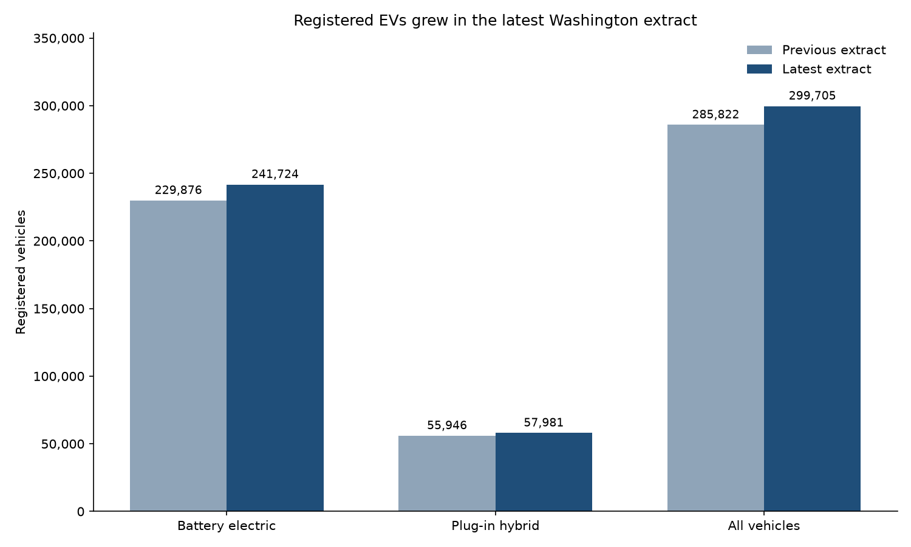
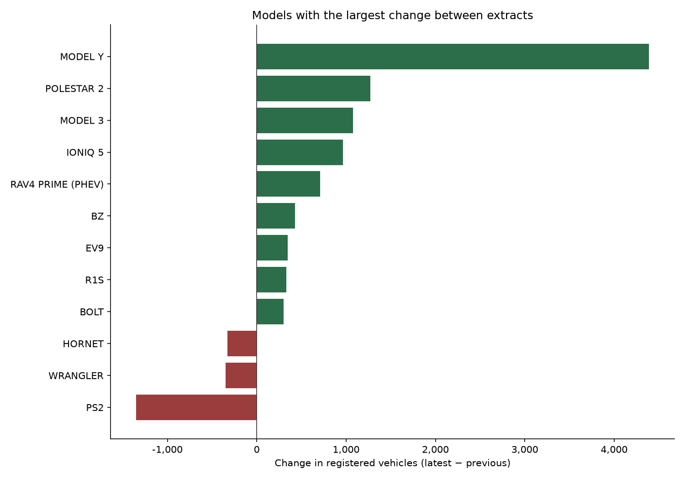
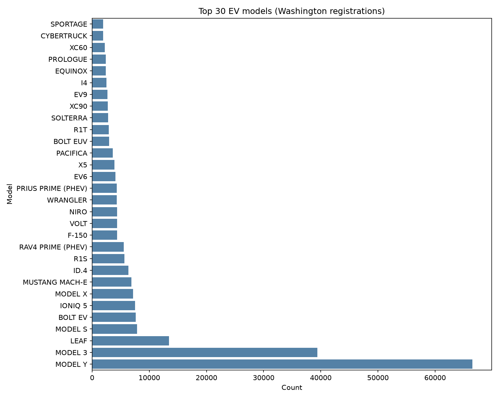

# Washington Electric Vehicle Registrations

A small data pipeline for the [Washington State Electric Vehicle Population Data](https://data.wa.gov/Transportation/Electric-Vehicle-Population-Data/f6w7-q2d2). It checks each extract, ranks the most common models, and compares the previous file with the latest one.

The latest extract lists **13,883 more** registered electric vehicles than the previous one (**285,822** to **299,705**, about **4.9%**). Most of that growth is battery-electric vehicles.

## Comparison

`python compare.py` reads both extracts and writes two charts.

| | Previous (`asset/Data.csv`) | Latest (`asset/export.csv`) | Change |
|---|---:|---:|---:|
| All vehicles | 285,822 | 299,705 | +13,883 |
| Battery electric | 229,876 | 241,724 | +11,848 |
| Plug-in hybrid | 55,946 | 57,981 | +2,035 |

These are two snapshots of vehicles currently registered in Washington. Each row is one vehicle. **36,685** vehicle IDs appear only in the latest file, and **22,802** IDs from the previous file are gone, so the net gain is smaller than the number of newly listed vehicles.



Model Y accounts for the largest increase (**+4,391**). The drop in **PS2** (**−1,350**) lines up with the rise in **POLESTAR 2** (**+1,271**), which is a model-name change rather than fewer cars.



## Rank the latest extract

`python index.py` validates `asset/export.csv` and writes the top 30 models.



On the latest file that is **299,705** rows, **202** models, no blank model names, and the top 30 covering about **78%** of registrations.

## Setup

```powershell
python -m venv myenv
myenv\Scripts\Activate.ps1
pip install -r requirements.txt
```

Place the earlier extract at `asset/Data.csv` and the later extract at `asset/export.csv`.

## Run

```powershell
python index.py
python compare.py
```

Useful flags:

```powershell
python index.py --input asset/export.csv --top-n 30 --output-dir outputs
python compare.py --previous asset/Data.csv --latest asset/export.csv --output-dir outputs
```

## Outputs

| File | What it is |
|---|---|
| `outputs/top_models.csv` | Ranked model counts for the latest extract |
| `outputs/top_models.png` | Bar chart of those counts |
| `outputs/metrics.json` | Row count, distinct models, null rate, and top-model share |
| `outputs/compare_population.png` | Previous vs latest counts by vehicle type |
| `outputs/compare_model_change.png` | Models with the largest change between extracts |

## Tests

```powershell
pytest
```

Tests use a small fixture and in-memory frames. They do not read the full registration files.

## Layout

```text
index.py              latest-extract pipeline
compare.py            previous vs latest comparison
src/load.py           read a registration CSV
src/validate.py       required columns and null checks
src/transform.py      top models and quality metrics
src/chart.py          top-model chart
src/compare.py        population and model-change charts
tests/                fixture and unit tests
asset/                source extracts
outputs/              tables, metrics, and charts
```

## Docker

```powershell
docker build -t ev-registrations .
docker run --rm -v ${PWD}/outputs:/app/outputs ev-registrations
```

The image runs the latest-extract pipeline with a headless matplotlib backend and writes into `outputs/`.
